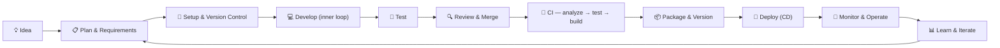
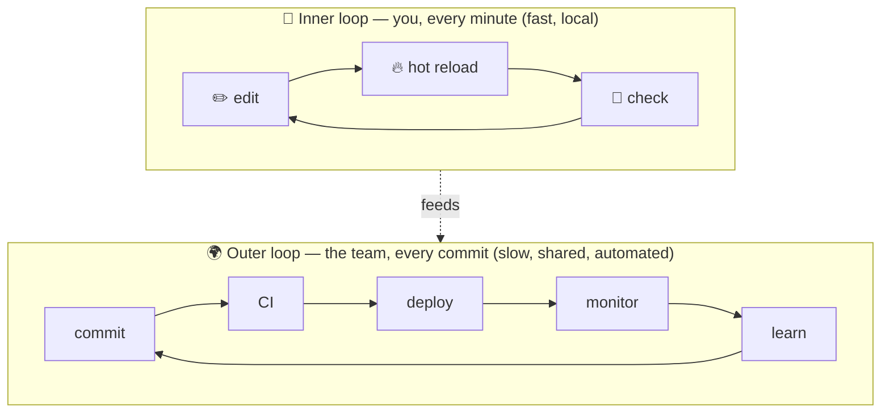
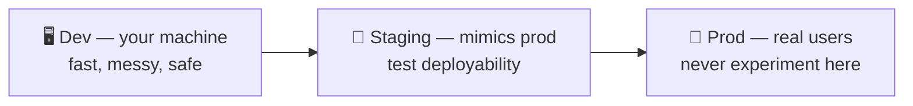
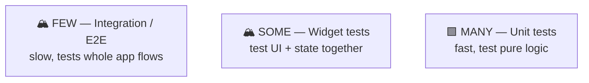
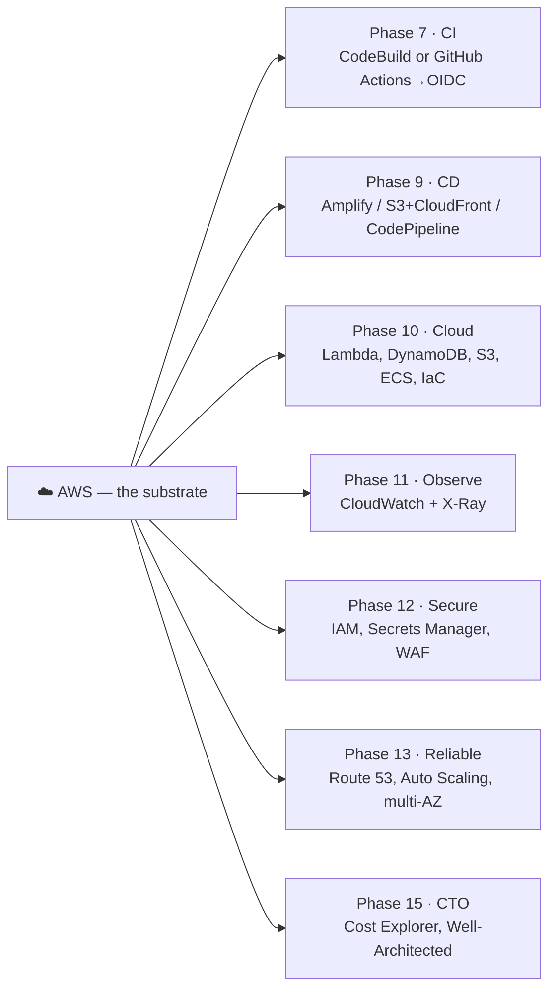
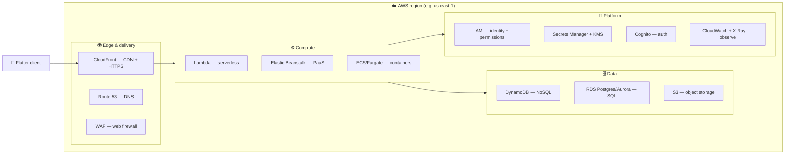
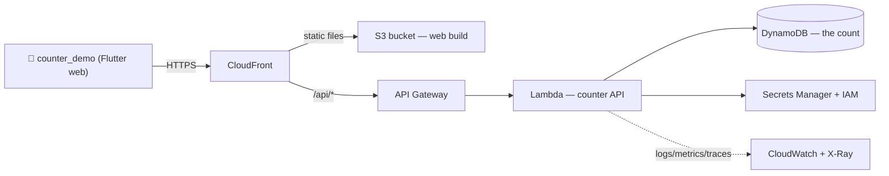
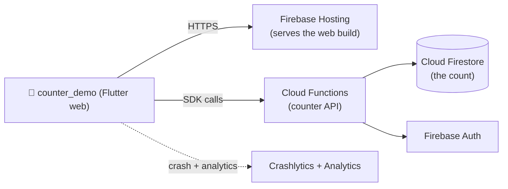
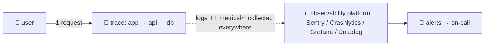

# 🗺️ The Full-Stack SDLC — A Hands-On Learning Roadmap

**Taught through `counter_demo`** — the Flutter counter app you created on 2026-08-16 (Flutter 3.47.0, version `0.1.0+1`, not yet a git repo).

**How to use this:** Do the phases **in order**. Before each phase read the **🧠 Understand first** section. Then do the **🛠️ Do** steps *yourself*. Only tick a ✅ checkpoint when you can explain *why* each step matters — not just run it. This is a course, not a checklist.

---

## The Master Map



**The core idea:** software doesn't end when code compiles. The lifecycle is a **loop**: plan → build → test → ship → operate → learn, and the learning feeds the next plan. A fullstack engineer / CTO doesn't just write code — they understand *every* stage, how the stages connect, and where every tool lives in the loop.

## The Inner Loop vs The Outer Loop



## The Environments Model



**Rule of thumb:** anything that happens in production must have already happened in staging first.

---

## Phase Map (the whole course in one table)

| # | Phase | What you'll learn | Core tools | SECA analog |
|---|-------|-------------------|------------|-------------|
| 0 | Mental model | The loop, environments, shift-left, 12-factor | — (concepts) | Research |
| 1 | Plan & requirements | Specs, user stories, acceptance criteria, tickets, ADRs | GitHub Issues / README | Plan |
| 2 | Version control | git, branches, commits, history, conventional commits | git, GitHub | Audit |
| 3 | Local development | The counter feature, hot reload, dependencies, state | Flutter, VS Code | Build |
| 4 | Quality gates | Formatting, linting, static analysis | `dart format`, `flutter analyze` | (gate) |
| 5 | Testing | Test pyramid, unit/widget/integration, coverage, TDD | `flutter test`, mockito | Test |
| 6 | Review & merge | PRs, code review, CI status checks, merge strategies | GitHub PRs | (gate) |
| 7 | Continuous Integration | Automate analyze+test+build on every push | GitHub Actions **or** AWS CodeBuild | CI |
| 8 | Packaging & versioning | SemVer, release builds, signing, app IDs | `flutter build`, Fastlane | Package |
| 9 | Continuous Delivery | Distribute/deploy automatically, env promotion | Fastlane, Firebase, **AWS Amplify / S3+CloudFront / CodePipeline** | Deploy |
| 10 | Cloud & backend | Servers, APIs, DBs, containers, IaC, serverless | Docker, Terraform, **AWS (Lambda, DynamoDB, S3, ECS)** | Stack |
| 11 | Observability | Logs, metrics, traces, crash reporting | Sentry, Crashlytics, **CloudWatch + X-Ray** | Operate |
| 12 | Security (DevSecOps) | Secrets, dependency audits, SAST, supply chain | Dependabot, osv-scanner, **IAM, Secrets Manager, WAF** | (gate) |
| 13 | Reliability (SRE) | SLOs, error budgets, runbooks, incident response | dashboards, runbooks, **Route 53, ASG, Well-Architected** | Verify |
| 14 | Feedback loop | Analytics → hypothesis → ship → measure → learn | feature flags, A/B | Learn |
| 15 | CTO layer | Cost, tech debt, architecture governance, platform | **Cost Explorer, budgets, Organizations** | — |

> ☁️ **AWS is not a phase — it's a substrate** that can back phases 7, 9–13, and 15. The **AWS Track** (just before Phase 10) maps every AWS service to the need it serves and gives you **two paths** to each goal.

**The handoff chain** — every phase produces the input the next phase consumes. If a phase feels unmotivated, check that you finished the one before it:

| Phase hands off | To |
|-----------------|----|
| 1 · a repo + an issue with acceptance criteria | → 2 |
| 2 · `main` with the scaffold pushed; a `feat/counter` branch | → 3 |
| 3 · a working counter with persistence (on the branch) | → 4 |
| 4 · formatted, analyzable code | → 5 |
| 5 · green tests that cover the Phase 1 criteria | → 6 |
| 6 · the reviewed feature merged to `main` | → 7 |
| 7 · automated gates that block bad merges | → 8 |
| 8 · versioned release artifacts (incl. `build/web`) | → 9 |
| 9 · the app live at a URL / in testers' hands | → AWS Track & 10 |
| 10 · a running API + database behind the app | → 11 |
| 11 · dashboards with crash + analytics data | → 12 |
| 12 · secrets out of code, dependencies audited | → 13 |
| 13 · an SLO + a runbook that actually works | → 14 |
| 14 · a North Star metric + a retro (new hypotheses) | → 15 |
| 15 · a strategy doc + debt log | → 🔁 back to 1 |

---

## Phase 0 — Build the Mental Model

**🧠 Understand first**
- The lifecycle is a **loop with feedback**, not a one-way assembly line.
- **Shift-left:** catch problems as early as possible (a bug found while writing is ~100× cheaper than one found in prod).
- **12-factor app** (12factor.net): the 12 rules for building software that deploys cleanly — config from environment, stateless processes, dev/prod parity, treat logs as event streams, etc. These matter from Phase 10 onward.
- **Definition of Done:** agree up front on what "done" means (code written? tested? deployed? monitored?). CTOs live and die by clear DoD.

**🛠️ Do**
1. Draw the master map above from memory on paper.
2. Write down, in one sentence each, what you think **CI**, **CD**, **staging**, and **observability** mean *before* you read the later phases. Re-check your answers after Phase 9 and 11.

**✅ Checkpoint** — You can explain why "it compiles" is not the same as "it's done."

---

## Phase 1 — Plan & Requirements

**🧠 Understand first**
- **Requirements → design → acceptance criteria.** The requirement is *what*; the design is *how*; acceptance criteria are *how we'll know it worked*.
- **User story format:** "As a `[role]`, I want `[feature]`, so that `[benefit]`."
- **Acceptance criteria** (Given/When/Then) are the seed of your future tests. Write them before code — this is the cheapest bug prevention there is.
- **Issues/tickets** (GitHub Issues, Jira, Linear): one unit of work = one ticket. Good tickets have title, description, acceptance criteria, and a size estimate.
- **ADR (Architecture Decision Record):** a short doc capturing *why* you chose a design, so future engineers don't reverse it unknowingly. Format: Context → Decision → Consequences.

**🛠️ Do**
1. In GitHub, create a new repo named `counter_demo` (private, **empty** — no README, no .gitignore). **Don't connect/push yet** — Phase 2 owns all local git setup and your first commit. *(If you haven't made an account, do that — GitHub is where most of the modern lifecycle lives.)*
2. Create a GitHub Issue: "Build the counter feature".
   - Story: "As a user, I want to tap a button to increment and decrement a counter, so that I can track a number."
   - Acceptance criteria (Given/When/Then):
     - GIVEN the app opens WHEN I see the screen THEN the counter shows `0`.
     - GIVEN the counter shows `n` WHEN I tap **+** THEN it shows `n+1`.
     - GIVEN the counter shows `n` WHEN I tap **−** THEN it shows `n−1`.
     - GIVEN the counter is at `0` WHEN I tap **−** THEN it stays at `0` (no negatives — a design choice; state it in the ticket).
3. Write the ADR: `docs/adr/0001-counter-state-management.md` — Context: "app is a demo; keep state local to the widget." Decision: "use `StatefulWidget` + `setState`." Consequences: "simple; won't scale to large apps — acceptable for a demo."

**✅ Checkpoint** — Your acceptance criteria are specific enough that a stranger could test them.

---

## Phase 2 — Version Control (git)

**🧠 Understand first**
- **Why git:** history, collaboration, safety. Every change is recorded and reversible; many people work in parallel.
- **The 3 states:** working tree → **staged** (index) → **committed** (history).
- **Branches:** an independent line of work. `main` is sacred — you rarely commit to it directly.
- **Conventional commits:** `type(scope): message` — `feat`, `fix`, `chore`, `docs`, `test`, `refactor`, `ci`. Machines (and teammates) parse this format for changelogs and automation.
- **.gitignore:** files that must never be committed (secrets, build output, local config). Your Flutter project already has a good one.

**🛠️ Do**
```bash
cd /Users/bkakwayena/Desktop/Decks/counter_demo
git init -b main
git add .
git commit -m "chore: scaffold flutter counter_demo app"
git remote add origin https://github.com/<you>/counter_demo.git
git push -u origin main
```
1. Run the commands above. (You confirmed earlier this folder is *not* yet a repo — so this is your first real commit. The last two lines connect it to the repo you created in Phase 1.)
2. Look at your history: `git log --oneline --graph --all`
3. Create a feature branch for your work: `git checkout -b feat/counter`
4. Learn these commands by using them repeatedly: `status`, `add`, `commit`, `log`, `diff`, `checkout`/`switch`, `merge`.

**✅ Checkpoint** — `git log` shows a clean history, you're on `feat/counter`, and you can explain what a commit *is* (a snapshot of your whole project, not just the file you changed).

---

## Phase 3 — Local Development (BUILD)

**🧠 Understand first**
- **The inner loop:** edit → hot reload → check. Flutter's hot reload (press `r` in the terminal) pushes Dart changes in ~a second — this is why Flutter devs iterate so fast.
- **Widgets, state, and `setState`:** Flutter UI is a tree of widgets. When state changes, you call `setState` and Flutter rebuilds only what changed.
- **Dependencies:** declared in `pubspec.yaml`, resolved to exact versions in `pubspec.lock` (commit the lock file!). `flutter pub add` updates both.
- **Structure:** `lib/` = your code; `main.dart` is the entry point. As apps grow: split into `lib/features/`, `lib/widgets/`, `lib/models/`, `lib/services/`.

**🛠️ Do**
1. Run the app: `flutter run` (choose macOS or Chrome — macOS is easiest for you).
2. Implement the counter in `lib/main.dart` as a `StatefulWidget` with `+` / `−` buttons. Your reference (write it yourself first, then compare):

```dart
import 'package:flutter/material.dart';

void main() => runApp(const MainApp());

class MainApp extends StatelessWidget {
  const MainApp({super.key});

  @override
  Widget build(BuildContext context) {
    return const MaterialApp(home: CounterPage());
  }
}

class CounterPage extends StatefulWidget {
  const CounterPage({super.key});
  @override
  State<CounterPage> createState() => _CounterPageState();
}

class _CounterPageState extends State<CounterPage> {
  int _count = 0;

  void _increment() => setState(() => _count++);
  void _decrement() => setState(() => _count = _count > 0 ? _count - 1 : 0);

  @override
  Widget build(BuildContext context) {
    return Scaffold(
      appBar: AppBar(title: const Text('Counter')),
      body: Center(
        child: Column(
          mainAxisAlignment: MainAxisAlignment.center,
          children: [
            Text('$_count', style: Theme.of(context).textTheme.displayLarge),
            const SizedBox(height: 16),
            Row(
              mainAxisAlignment: MainAxisAlignment.center,
              children: [
                IconButton(
                  icon: const Icon(Icons.remove_circle_outline),
                  onPressed: _decrement,
                ),
                IconButton(
                  icon: const Icon(Icons.add_circle_outline),
                  onPressed: _increment,
                ),
              ],
            ),
          ],
        ),
      ),
    );
  }
}
```
3. Practice hot reload: change a color, save, watch it update live.
4. Add a real dependency to learn the workflow: `flutter pub add shared_preferences` (persists the count), then wire it up. Check `pubspec.yaml` and `pubspec.lock` changed.

**✅ Checkpoint** — App runs, counter works, hot reload is natural to you, and you can explain what `pubspec.lock` is for.

---

## Phase 4 — Quality Gates: Format + Lint + Analyze

**🧠 Understand first**
- **Formatter** (`dart format`): makes every file the same style → no more style debates in code review.
- **Linter/analyzer** (`flutter analyze`): catches bugs *before* runtime — unused vars, dead code, type errors, common anti-patterns. `analysis_options.yaml` configures the rules (`flutter_lints` is the official set).
- **CI gate:** these become automated "gates" in Phase 7 that block merging if violated. A gate = an automated check that must pass.

**🛠️ Do**
```bash
dart format .
flutter analyze
```
1. Run both. If analyze reports anything, fix it.
2. Read `analysis_options.yaml`, then turn on a stricter rule (e.g., `always_declare_return_types`) and see analyze's opinion change.

**✅ Checkpoint** — `flutter analyze` exits with zero issues and you understand *why* you'd automate this.

---

## Phase 5 — Testing (TEST)

**🧠 Understand first**
- **The test pyramid:** many fast unit tests at the bottom, fewer slower integration/E2E tests at the top.



- **Unit test:** one function/class in isolation. **Widget test:** renders a widget, taps it, asserts state/UI. **Integration test:** the whole app on a device.
- **TDD (test-driven development):** write a failing test → make it pass → refactor. Forces you to think about behavior before implementation.
- **Coverage** is a *signal*, not a goal: 100% coverage of bad tests is worthless. High-value coverage > high coverage.

**🛠️ Do**
1. Refactor to make the logic testable: extract a `CounterModel` class (a plain Dart class holding `count` with `increment()` and `decrement()` that clamps at 0) into `lib/counter_model.dart`, and have the widget use it. *This is the "make it testable" habit — pure logic lives outside the UI.* Keep the app's behavior identical while refactoring — if you wired `shared_preferences` in Phase 3, the counter must still persist after this change (the tests cover the logic; run the app to confirm persistence still works).
2. Write unit tests in `test/counter_model_test.dart` covering: starts at 0, increments, decrements, never goes below 0.
3. Write a widget test in `test/widget_test.dart`: pump the app, verify it shows `0`, tap `+`, verify `1`.
4. Run: `flutter test` and then `flutter test --coverage`. Open `coverage/lcov.info` and skim it.

**✅ Checkpoint** — `flutter test` is green and every acceptance criterion from Phase 1 maps to a test you wrote.

---

## Phase 6 — Review & Merge

**🧠 Understand first**
- **Pull Request (PR):** the ceremony around merging a branch into `main`. Purpose: *other eyes on your code* + *automated checks must pass* (Phase 7).
- **Reviewer mindset:** check correctness, clarity, tests, and that it matches the ticket. Not style nits (the formatter handles that).
- **Merge strategies:** squash (one clean commit per PR — common), merge, rebase.
- **Trunk-based vs Git Flow:** start with **trunk-based** (short-lived branches, merge to `main` often, release from `main`). Git Flow (long-lived `develop`/`release` branches) is heavier — revisit it later.

**🛠️ Do**
1. Push your branch and open a PR to `main`:
```bash
git add . && git commit -m "feat: add counter with tests and persistence"
git push -u origin feat/counter
```
2. In the PR description, paste the acceptance criteria from Phase 1 and a checklist.
3. Review your own PR with fresh eyes (a real skill). Then merge it.

**✅ Checkpoint** — You can explain the *purpose* of a PR (it's a quality gate, not a formality).

---

## Phase 7 — Continuous Integration (CI)

**🧠 Understand first**
- **CI:** every push/PR automatically runs: format check → analyze → tests → build. The machine enforces Phase 4 + 5, every time, consistently.
- **Why:** humans forget; machines don't. "Works on my machine" becomes "works in CI."
- **GitHub Actions basics:** workflows live in `.github/workflows/*.yml`. A workflow = triggers + jobs + steps. `matrix` runs the same job on multiple OSes.

**🛠️ Do**
1. Create `.github/workflows/ci.yml`:

```yaml
name: CI

on:
  push:
    branches: [main]
  pull_request:

jobs:
  test:
    runs-on: ubuntu-latest
    steps:
      - uses: actions/checkout@v4
      - uses: subosito/flutter-action@v2
        with:
          flutter-version: '3.47.0'
          channel: 'stable'
      - run: flutter pub get
      - run: dart format --output=none --set-exit-if-changed .
      - run: flutter analyze
      - run: flutter test
      - run: flutter build web --release
```

2. Land it like a real change (reuse the Phase 6 ritual): `git checkout -b ci/setup`, add the workflow, `git commit -m "ci: add analyze/test/build pipeline"`, push, open a PR, merge. CI runs on the PR *and* again on `main`.
3. Make CI **required** in GitHub → Settings → Branches so a red CI blocks merging.
4. **Experiment:** break a test, push, watch CI turn red. Fix it, push, watch it turn green. *This is the learning moment.*

**✅ Checkpoint** — You can read a workflow file and explain trigger / job / step, and you've seen CI go red and green.

**Two paths — where AWS fits in CI:**
- **Path A — GitHub Actions (what you just did):** keep CI where your code lives. To deploy to AWS from Actions, assume an **IAM role via OIDC** (no long-lived keys) with `aws-actions/configure-aws-credentials@v4`.
- **Path B — AWS-native CI:** **CodePipeline + CodeBuild** orchestrate build → test → deploy entirely inside AWS. Same concepts (source → build → deploy), different home. Learn A first; B is worth knowing once your whole stack is in AWS.
- **Bonus cost move:** heavy Flutter builds can run on a **self-hosted runner on EC2** to save Actions minutes.

---

## Phase 8 — Packaging & Versioning

**🧠 Understand first**
- **Semantic Versioning (SemVer):** `MAJOR.MINOR.PATCH` — `1.2.3`. Breaking change → MAJOR; new feature → MINOR; bugfix → PATCH. Your pubspec is `0.1.0+1`: version `0.1.0`, build number `1` (the `+1`).
- **Release build ≠ debug build:** release is optimized, minified, and (for mobile) *signed*.
- **Build artifacts:** for Flutter — APK/AAB (Android), IPA (iOS), web bundle, desktop bundles. Stores require specific formats: Google Play requires **AAB**, Apple requires **IPA via Xcode**.
- **Signing:** proving the artifact is yours. Android uses a keystore; iOS uses Apple certificates/provisioning. Fastlane (Phase 9) manages this.
- **App IDs / package name:** a globally-unique identifier (e.g., `com.yourname.counter_demo`). Change it once, early — changing later is painful.

**🛠️ Do**
```bash
flutter doctor
flutter build apk --release
flutter build appbundle --release
flutter build web --release
```
1. Run `flutter doctor` first — if the Android toolchain (Android Studio/SDK) is missing, **skip the apk/appbundle builds** and do `flutter build web --release`; web always works. Don't let tooling gaps stall the lesson.
2. Run the builds above. Find the artifacts (`build/app/outputs/...`).
3. Bump the version in `pubspec.yaml` to `0.1.1+2` after your first fix — get used to *every change gets a version*.

**✅ Checkpoint** — You can explain what an AAB is and why Google wants it instead of an APK.

---

## Phase 9 — Continuous Delivery (CD) & Deployment

**🧠 Understand first**
- **CI vs CD:** CI proves the code is good (analyze/test/build). CD **delivers** it — automatically building, distributing, and deploying. CI is about *confidence*; CD is about *shipping*.
- **Environment promotion:** the artifact is built once, then promoted dev → staging → prod. The same binary in every env = "I tested exactly what you're using."
- **Rollout strategies:** staged rollout (10% → 100%), blue/green (two environments, flip traffic), canary (new version to a few users first).
- **Mobile distribution:** Google Play / App Store / TestFlight / Firebase App Distribution (internal testers).
- **Web/backend deployment:** static hosting (Firebase Hosting, Netlify, Vercel) or servers.

**🛠️ Do — pick the path that interests you:**
- **A. Deploy the web build (fastest, most satisfying):** `flutter build web --release`, then deploy the `build/web` folder to **Firebase Hosting** or **Vercel**/**Netlify** (all have free tiers + CLI guides). You now have *real users* on a URL.
- **B. Mobile internal distribution:** add **Fastlane** + **Firebase App Distribution** and ship an APK to "testers" with one command. Fastlane = automation for iOS/Android build & release (lanes, signing management).
- **C. Full CD in CI:** extend your GitHub Actions workflow to build a release artifact *on a git tag* (`on: push: tags`) and upload it as a release asset.
- **D. AWS managed hosting:** **Amplify Hosting** deploys the Flutter web build with one `amplify publish` — the closest AWS analog to Vercel.
- **E. AWS infrastructure hosting:** put `build/web` in **S3** and serve it via **CloudFront** (CDN + HTTPS, cheap). This is the "real AWS" way — it teaches S3, IAM, and CloudFront together.
- **F. AWS-native CD:** **CodePipeline** watches your repo → builds → deploys to S3, Elastic Beanstalk, or ECS.

**Two paths, same lesson:** A/D are the *managed* hosting route; E/F are the *infrastructure* hosting route. B (mobile) and C (tag-released artifacts) are automation angles on the same idea. Do one managed **and** one infrastructure option so you can feel the difference between "the platform deploys for me" and "I wire the deploy myself."

**✅ Checkpoint** — You have a counter app delivered somewhere real (a URL, testers' hands, or a release artifact), and you can explain the difference between CI and CD.

---

## ☁️ The AWS Track — where it plugs into everything

**AWS is not a phase — it's the cloud substrate that can back almost every phase of the loop.** If you standardize on AWS, this is how it threads through the course:



### Core idea: services map to *needs*, not to phases



### The counter_demo reference architecture (the "fullstack" version)



**The Firebase twin — same job, different vendor (your redundant path):**



Same app, same concepts (hosting, functions, database, auth, observability) — one managed by Firebase, one by AWS.

### The design principle: **two paths to every goal**

For every job in the lifecycle there are (at least) two legitimate routes. Learn **Path A first** (managed, low-ops, fast), then **Path B** (infrastructure, high-control) once you can name what you're trading. The two paths are deliberately redundant — same mental model, different amount of manual control:

| Goal | 🟢 Path A — Managed & fast (learn first) | 🔵 Path B — Infrastructure & control (learn later) |
|------|------------------------------------------|-----------------------------------------------------|
| Host the web build | **Amplify Hosting** (one command) | **S3 + CloudFront** (+ Route 53 for the domain) |
| Backend API | **Amplify** (GraphQL/REST) or **Elastic Beanstalk** | **API Gateway + Lambda** (serverless) |
| Run containers | **ECS Fargate** (no servers to manage) | **EC2 / EKS** (Kubernetes, full control) |
| Database | **RDS Postgres/Aurora** (SQL) or **DynamoDB** (NoSQL) | self-managed database on EC2 |
| CI | **CodePipeline + CodeBuild** | **GitHub Actions** + IAM role via OIDC |
| CD / deploy | **Amplify / CodeDeploy** | **CodePipeline → S3 / Beanstalk / ECS** |
| Infra as code | **AWS CDK** (TypeScript, AWS-native) | **Terraform** (cloud-agnostic) |
| Secrets | **Secrets Manager** (+ IAM) | environment variables + **KMS** |
| Auth | **Cognito** | custom OIDC identity provider |
| Observe | **CloudWatch** (built-in) | CloudWatch + **X-Ray** + Grafana/Prometheus |
| Threat detection | **GuardDuty + Security Hub** | self-managed scanners + WAF rules |

**Rule of thumb:** start managed (Path A) — it teaches the *concept* without the *ops*. Graduate to Path B when you can name the trade-off you're making (cost, control, complexity).

**And the same two-path logic exists at the *vendor* level.** Firebase is the non-AWS managed alternative — for nearly every AWS service there's a Firebase twin doing the same job with less ops:

| Job | ☁️ Firebase (Path A — fully managed) | 🌩️ AWS (Path B — infrastructure) |
|-----|--------------------------------------|-----------------------------------|
| Host the web build | **Firebase Hosting** | **Amplify / S3 + CloudFront** |
| Backend functions | **Cloud Functions** | **Lambda** |
| Database | **Cloud Firestore** (NoSQL) | **DynamoDB** (NoSQL) or RDS (SQL) |
| User auth | **Firebase Auth** | **Cognito** |
| Crash + analytics | **Crashlytics + Analytics** | **CloudWatch + X-Ray** |
| CDN / HTTPS | built in | **CloudFront** |

Pick Firebase first if you want the *least* ops; pick AWS when you want control and to learn infrastructure. Both teach the same concepts — that's the redundancy.

---

## Phase 10 — Cloud & Backend on AWS (the "service" half)

**🧠 Understand first** — this is where "fullstack" expands:
- **Client vs server vs database:** your Flutter app is a *client*. Most real apps also have a *server* (API) and a *database*.
- **The request lifecycle:** app → HTTP request → API → (auth, validation) → database → response → app renders.
- **Cloud model ladder:** IaaS (raw VMs — AWS EC2) → PaaS (managed runtime — Elastic Beanstalk, Firebase, Vercel) → SaaS (use it, don't run it). Start with PaaS; graduate to IaaS.
- **Containers (Docker):** package your app + its exact OS/runtime into a portable unit. ECS Fargate runs containers *without* you managing servers; EKS adds Kubernetes on top.
- **Infrastructure as Code (IaC):** describe your servers/DBs/network as code. **Two paths:** **AWS CDK** (TypeScript, AWS-native) vs **Terraform** (cloud-agnostic). Same goal, two dialects.
- **Serverless:** run functions without servers — **API Gateway + Lambda**. Perfect for a small API like ours.
- **Databases — two paths:** **SQL** (Amazon RDS: Postgres/Aurora) vs **NoSQL** (DynamoDB). SQL is the default until you have a reason not to; DynamoDB wins for simple key-value data (a counter!) at scale.
- **Networking & identity:** a **VPC** is your private network; subnets + security groups are your firewalls; **IAM** decides *who can do what*. These three confuse everyone — see them early.
- **The one mental model:** every AWS thing lives in a **region** (you pick `us-east-1`), has an **ARN** (its address), and is governed by an **IAM policy** (permission).

**🛠️ Do — three redundant paths; they're the same lesson at different depths. Pick where to start:**
1. **Create accounts:** an **AWS** account (free tier, `aws configure`, add **MFA** to root) and/or a **Firebase** project (Google account). One is enough to learn; both = seeing the same concept twice.
2. **Path A — Firebase (managed, non-AWS — the fastest route):** add Firebase to `counter_demo` and store the counter in **Cloud Firestore** so it syncs across devices (Firebase's "Add Firebase to Flutter" codelab). Same mental model as DynamoDB, zero servers to manage.
3. **Path B — AWS Amplify (managed, AWS):** in **Amplify Hosting**, connect your GitHub repo and it auto-deploys the Flutter web build on every push. Least AWS friction.
4. **Path C — S3 + CloudFront (infrastructure, AWS):** *(a deeper version of Phase 9-E — same idea, now with an API behind it)*
   ```bash
   aws s3 mb s3://counter-demo-web              # create a bucket
   aws s3 sync build/web s3://counter-demo-web  # upload the web build
   ```
   then create a **CloudFront** distribution pointing at the bucket (CDN + HTTPS). You've now touched S3 (object storage), IAM (bucket policy), and CloudFront (CDN).
5. **Add the serverless API (the real fullstack step):** AWS = **Lambda** + **API Gateway** + **DynamoDB**; Firebase = **Cloud Functions** + **Firestore**. Either way the Flutter web app calls an API over HTTPS. Write AWS infra with **CDK** (managed-ish) or **Terraform** (infrastructure).
6. Skim the **VPC** and **IAM** consoles — just look, don't build. Two concepts that block everyone.

**✅ Checkpoint** — You can draw your client → API → database diagram for the path you chose (AWS: CloudFront → Lambda → DynamoDB; Firebase: Hosting → Cloud Functions → Firestore), and explain what Docker, Terraform, and IAM each do (and why they're different).

---

## Phase 11 — Observability: Logs, Metrics, Traces

**🧠 Understand first**
- **The three pillars:**
  - **Logs:** discrete events ("request failed with 500"). Structured (JSON) beats free-text.
  - **Metrics:** numbers over time (error rate, latency, memory). Dashboards + alerts.
  - **Traces:** the full journey of one request across services (frontend → API → DB). This is how you find the *slow* hop.
- **Crash reporting:** automatic collection of stack traces when users crash (Sentry, Firebase Crashlytics). *You cannot debug what you never see.*
- **Analytics:** product events (how many people tapped +). Different from technical monitoring.
- **Alerting:** metrics are useless unless they page someone at 3am. Alert on *user impact* (error rate), not noise.



**🛠️ Do**
1. Add **Sentry** to `counter_demo` (smallest friction, best docs): `flutter pub add sentry_flutter`, init it in `main()`, and make your app throw deliberately. Then watch the error appear in Sentry's dashboard. *This is the "seeing is believing" moment.*
2. Add **Firebase Analytics** and log a `counter_incremented` event. See it in the Analytics console.
3. Skim how a cloud console shows metrics + logs for any service you deployed in Phase 10.
4. **Two paths — where AWS fits:**
   - **Path A — app-level (do this):** Sentry + Firebase Analytics. They see *your code*, on any infra.
   - **Path B — infra-level (AWS):** **CloudWatch** collects logs, metrics, and alarms; **X-Ray** traces one request across CloudFront → Lambda → DynamoDB so you find the *slow hop*. If your backend is on AWS, CloudWatch is unavoidable — and mostly free.

**✅ Checkpoint** — You can explain the difference between a log, a metric, and a trace, and you've watched a real crash appear in a dashboard.

---

## Phase 12 — Security (DevSecOps)

**🧠 Understand first**
- **Threat model first:** who attacks you, and how? For a demo app: low risk. For anything real: think auth, data, injection.
- **Secrets management:** secrets (API keys, passwords, certificates) **never** go in git or client code. Use environment variables locally, and a secrets manager in prod (cloud secret managers, Vault, GitHub Secrets in CI).
- **Supply chain:** your app is built from dependencies you didn't write. Auditing them is non-negotiable (Dependabot, osv-scanner, Snyk).
- **SAST vs DAST:** Static analysis scans source for vulnerabilities (Semgrep, CodeQL); Dynamic scans the running app (OWASP ZAP).
- **OWASP Top 10:** the canonical list of web app risks — read it once, it pays forever.
- **The AWS security stack:** **IAM** (identity + least-privilege policies — never `*`), **Secrets Manager** + **KMS** (encryption keys), **WAF** in front of CloudFront, **GuardDuty** (threat detection), **Security Hub** (one dashboard).

**🛠️ Do**
1. `flutter pub outdated` — learn what's stale.
2. Enable **Dependabot** on your GitHub repo (free, automated dependency PRs). Watch it open PRs for outdated packages.
3. Add `osv-scanner` (or Dependabot's `pub` support) to CI as a gate.
4. Put any API key you used in Phase 10/11 into **GitHub Secrets** (repo Settings → Secrets), not your code. Read them via `secrets.XXX` in workflows or environment variables.
5. **AWS layer (only if your backend is on AWS):** put API keys in **Secrets Manager** instead of GitHub Secrets — two paths to the same goal, AWS keeps them close to the service that uses them. Encrypt at rest with **KMS**, put **WAF** in front of CloudFront, and turn on **GuardDuty** (then just look at **Security Hub** once).

**✅ Checkpoint** — You can list what a secret is, where it should live, and what "supply-chain security" means.

---

## Phase 13 — Reliability & Operations (SRE mindset)

**🧠 Understand first**
- **SLO / error budget:** SLO = "99.9% of requests succeed in <300ms" (a promise). Error budget = the allowed failure (0.1%). When you exceed it, you stop shipping features and fix reliability. This is how mature teams decide "are we allowed to break things?"
- **Incident response:** detect → declare → mitigate (rollback > fix-in-prod) → postmortem. **Blameless postmortems** — you fix the *process*, not the person.
- **Runbooks:** written, step-by-step "when X breaks, do Y." If it's not written down, an on-call engineer at 3am doesn't know it.
- **Chaos engineering:** deliberately break things (kill a server, cut network) in staging to prove your system survives. (This is literally the SECA "CHAOS" stage.)
- **The AWS reliability stack:** **Route 53** (DNS + failover), multiple **Availability Zones** (redundant data centers), **Auto Scaling Groups** (replace failed instances), **Elastic Load Balancer** (spread traffic), **CloudWatch alarms** (alert on SLO breach). AWS's **Well-Architected Framework** (6 pillars) is AWS's own version of this course — it's free and worth reading.

**🛠️ Do**
1. Write a **runbook**: `docs/runbook.md` — "If the counter app shows a blank screen, check: 1) crash report in Sentry 2) backend/db status 3) rollback to last good release."
2. Define an **SLO** for your web deploy: e.g., "99.5% of page loads succeed in <2s." Write down how you'd *measure* it (Phase 11 tools).
3. Practice a **mock incident**: break your deploy on purpose in staging, time-box 10 minutes to recover using only your runbook, then write a 5-line blameless postmortem.
4. **AWS drill:** in the CloudFront/EC2 console, write down how you'd *detect* an outage (CloudWatch alarm), *respond* (runbook → Route 53 failover or redeploy), and how **multi-AZ + Auto Scaling** gives you redundancy without you doing anything.

**✅ Checkpoint** — You can explain SLO vs error budget, and you've run a drill from your own runbook.

---

## Phase 14 — The Feedback Loop (LEARN)

**🧠 Understand first**
- **The scientific loop for products:** hypothesis → build → ship → **measure** → learn → next hypothesis. Analytics (Phase 11) is the measuring instrument.
- **Feature flags:** ship code behind a switch, turn it on for 10% of users, compare, turn off without a redeploy. The default way to ship risky features.
- **A/B testing:** show group A and group B different versions, measure which wins on a metric.
- **Retrospectives:** a recurring team ritual — what went well / what went wrong / what we'll change. The team-level version of the feedback loop.

**🛠️ Do**
1. Add a **feature flag** for the "dark mode" or a "double-tap to reset" feature — a `bool flag` (even hardcoded) plus analytics events on both paths.
2. Set a **North Star metric** for the counter app (e.g., "increments per session") and check it in Analytics.
3. Run a 10-minute **retro** with yourself: what did you learn this course? Write 3 things you'll do differently next project.

**✅ Checkpoint** — You can articulate: "I shipped a thing, here's the metric that tells me if it worked."

---

## Phase 15 — The CTO Layer

**🧠 Understand first** — the parts of the lifecycle that aren't code:
- **Cost management:** every cloud resource costs money. Tag resources, set budgets/alerts, review monthly. Idle dev environments are the usual waste.
- **Technical debt:** the interest you pay on shortcuts. Track it (a "debt log") and schedule repayment — but *deliberately*, not reactively.
- **Architecture governance:** how you say "no" — ADRs (Phase 1), standards, and review rituals. Consistency beats cleverness in a team.
- **Platform engineering:** treating your CI/CD, environments, and tooling as a *product* your engineers use. (This is literally the FARM/SECA idea: pipelines with gates and a feedback loop.)
- **Team & process:** hiring, on-call rotation, documentation, the dev experience.
- **Compliance:** GDPR/CCPA (data privacy), SOC2 — when the business needs them. Understand *when*, don't over-engineer early.
- **AWS cost management:** **Cost Explorer** + budgets + alerts; **tag everything** (`env=dev`, owner, app) or you can't attribute cost; tear down idle dev resources (the usual waste); **Organizations** centralizes billing/accounts at scale.
- **Well-Architected Reviews:** AWS's free framework for auditing any architecture against 6 pillars (Reliability, Security, Cost, Performance, Operations, Sustainability) — the CTO ritual for "is our house in order?"

**🛠️ Do**
1. Write `docs/platform-strategy.md` (5 bullets): environments, CI/CD, observability, security baseline, cost approach — for a 3-person team.
2. Keep a **tech-debt log**: 3 entries from this course (e.g., "counter uses local state only", "no integration tests", "hardcoded feature flag").
3. **AWS cost drill:** in the AWS console set a **$5 monthly budget** with an alert, and **tag** the resources you created (`env=dev`). Skim the **Well-Architected** console once.
4. **🔁 Close the loop:** pick one item from your Phase 14 retro or your tech-debt log, file it as a new GitHub issue (the Phase 1 workflow), and start a new branch for it. You've just run the full loop — you're back at Phase 1, but you now know what you're doing.

**✅ Checkpoint** — You can look at any project and say where it is in the lifecycle, what's missing, and what to do next — and you've started your *second* trip around the loop.

---

## 📈 Suggested Pace

| Week | Phases | Daily commitment |
|------|--------|------------------|
| 1 | 0–3 | 1h/day: mental model, git, build the counter |
| 2 | 4–7 | 1h/day: quality gates, tests, PR, CI |
| 3 | 8–11 | 1h/day: packaging, CD, cloud, observability |
| 4 | 12–15 | 1h/day: security, SRE, feedback loop, CTO layer |

> **AWS note:** the AWS Track (between Phases 9 and 10) slots into Week 3. If you only have 2 weeks, do **Path A** (managed) for each AWS goal and defer Path B.

## 🔧 The One-Page Tool Map

| Lifecycle stage | Core tools | AWS option (two paths) |
|-----------------|------------|------------------------|
| Plan | GitHub Issues, ADRs, README | — |
| Code | Flutter, VS Code, git | — |
| Quality | `dart format`, `flutter analyze`, lints | CodeGuru (code review) |
| Test | `flutter test`, coverage, mockito | Device Farm (real-device tests) |
| Collaborate | GitHub PRs, code review | — (keep repos on GitHub) |
| CI | GitHub Actions | CodeBuild / CodePipeline |
| Package | `flutter build`, SemVer | CodeArtifact (package registry) |
| Deploy | Fastlane, Firebase, Vercel/Netlify | Amplify / S3+CloudFront / CodeDeploy |
| Cloud/Backend | Firebase, Node/Python, Docker, Terraform | Lambda, DynamoDB, RDS, S3, ECS, CDK |
| Observe | Sentry, Crashlytics, Analytics | CloudWatch, X-Ray |
| Secure | Dependabot, osv-scanner, GitHub Secrets, Semgrep | IAM, Secrets Manager, WAF, GuardDuty |
| Operate | SLOs, runbooks, postmortems | Route 53, Auto Scaling, Well-Architected |
| Learn | feature flags, A/B, retros | — |
| Cost | — | Cost Explorer, budgets, tagging |
